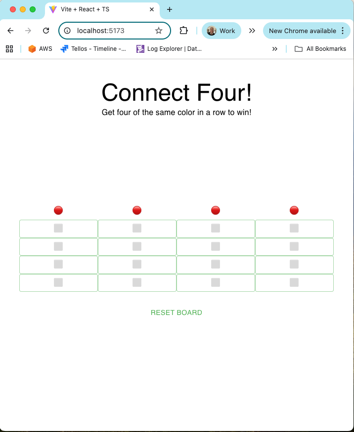
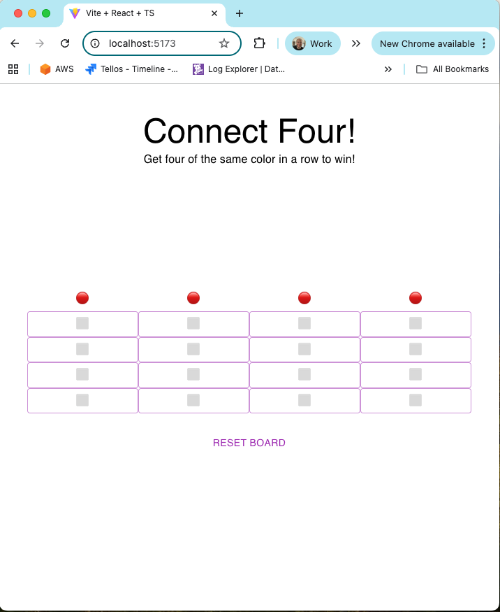

# Frontend Engineer Takehome Test

Welcome to the Tellos Takehome Test! This test is designed to evaluate your ability to use Typescript, React and MUI. Your submission will be judged against these criteria:

1. The simplicity of your solution (simpler is better)
2. How closely your solution mirrors the screenshots provided. Spacing is important!
3. Appropriate use Typescript types (submissions that contain use of the `any` type will be rejected)
4. Appropriate use of MUI components (especially Grid and Button)
5. Tests are a bonus

This test should take you no more than 3 hours.

## Project Description
In this project you will be implementing the Connect Four game. In the Connect Four game, two players (red 🔴 and black ⚫) take turns "dropping" a piece into the board. If there are ever 4 of the same color in a row (horizontally, vertically or diagonally) that player wins!

At any time you should be able to reset the game, which clears the board and sets it to the red player's turn.

If a column is full, no more pieces can be dropped in that column.

When a winner is found:
1. No more pieces can be dropped
2. The winner is displayed
3. The reset button switches to "New Game"

The title should stay in place when the window is resized. The board should track to the center of the window during a resize.

Icon for Red: 🔴
Icon for Black: ⚫
Icon for Blank space: ⬜

Please create a new project vite and the 

## Themeing
You should also include the ability to change the color of the primary/main palette to purple(500) and green(500). This doesn't need to be dynamic, its ok to make it a constant variable and refresh the screen to show the new palette.

